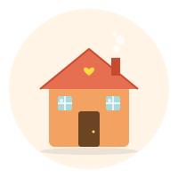

<div align="center">



# Roofly 🏡

### Rent management, simplified.

A modern property rental platform for Malaysian landlords.
Track tenants, generate agreements, collect rent online — all in one place.

[](https://laravel.com)
[](https://nuxt.com)
[](https://tailwindcss.com)
[](https://mysql.com)

[**Live Demo**](https://roofly.my) · [**Roadmap**](#-roadmap)

</div>

---

## ✨ What it does

Most Malaysian landlords manage rentals through a messy mix of WhatsApp, Excel, and paper agreements. Roofly fixes that.

🏠 **For owners** → Dashboard, agreements, rent tracking, maintenance Kanban
👥 **For tenants** → Pay rent in 2 taps, view agreement, report issues
🇲🇾 **Made for Malaysia** → FPX payments, BM/EN, WhatsApp notifications

---

## 🛠️ Built with

**Laravel 11** · **Nuxt 3** · **Tailwind** · **MySQL** · **Redis** · **RabbitMQ** · **Docker** · **Billplz** · **WhatsApp Cloud API**

---

## 🚀 Quick start

```bash
git clone https://github.com/byhaqie31/roofly.git
cd roofly
docker compose up -d --build
docker compose exec backend php artisan migrate --seed
```

Open `http://localhost:3000` and log in:

- 🏠 **Owner:** `owner@roofly.my` / `password`
- 👥 **Tenant:** `tenant@roofly.my` / `password`

---

## 🗺️ Roadmap

- [ ] **Phase 1** — Foundation, auth, base entities
- [ ] **Phase 2** — Properties, units, agreement PDFs
- [ ] **Phase 3** — Billplz payments, invoices, late fees
- [ ] **Phase 4** — WhatsApp + email reminders
- [ ] **Phase 5** — Maintenance tickets
- [ ] **Phase 6** — Reports, dashboards, polish
- [ ] **Phase 7** — Marketing site & beta launch

---

## 👋 About

Built by **[Qie](https://baihaqie.com)** — UI/UX-focused engineer based in Kuala Lumpur.
Part of the [Axel Nova Ventures](https://axelnova.tech) portfolio.

<div align="center">

Made with ❤️ in KL

</div>
