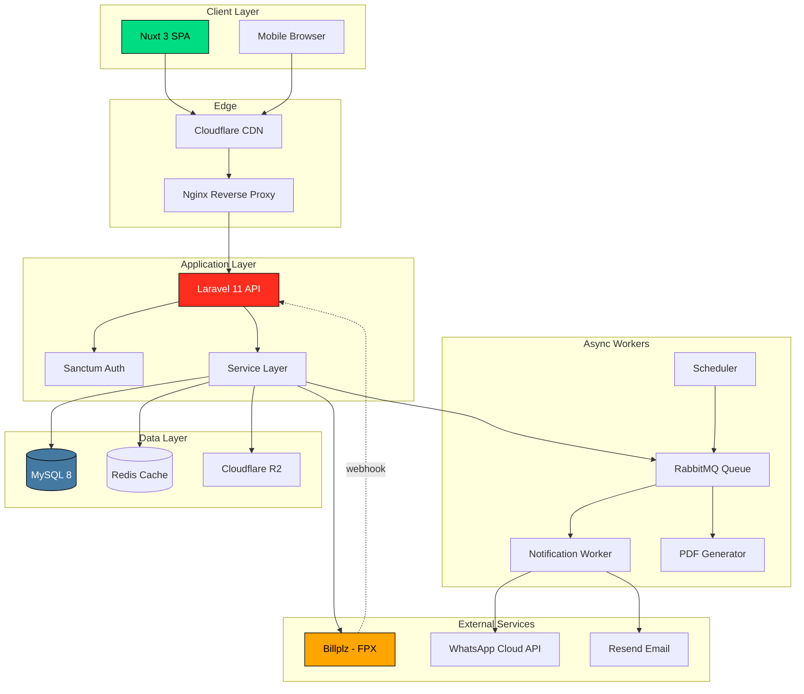
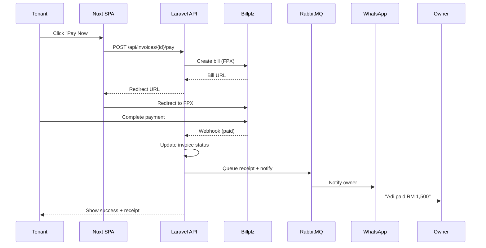
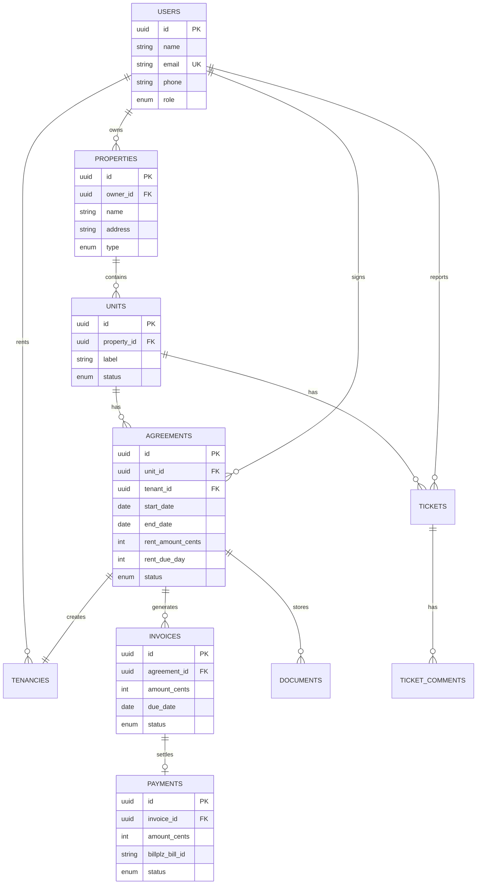
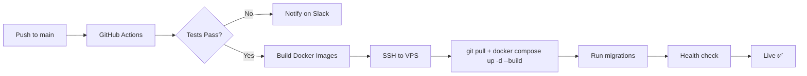

<div align="center">


# Hauz

### Rent management, simplified.

**A property rental management platform built for Malaysian landlords.**
Track tenants, generate agreements, collect rent online, and resolve maintenance issues — all in one place.

[](https://laravel.com)
[](https://nuxt.com)
[](https://tailwindcss.com)
[](https://mysql.com)
[](https://docker.com)
[](#)

[**Live Demo**](https://hauz.my) · [**Documentation**](./docs) · [**Report Bug**](https://github.com/byhaqie31/hauz/issues) · [**Roadmap**](#-roadmap)

---

</div>

## ✨ Why Hauz?

Most Malaysian landlords manage their rentals through a chaotic mix of WhatsApp, Excel sheets, and paper agreements. They forget who paid, lose track of agreement expiries, and dread tax season. Tenants don't have a clean way to pay rent or report issues without it feeling like a personal favor.

**Hauz fixes that.** It's a modern, mobile-first SaaS that gives owners visibility and tenants self-service — built specifically for the Malaysian context (FPX payments, BM/EN, WhatsApp notifications, local agreement templates).

> 🇲🇾 **Built for Malaysia first.** FPX via Billplz, Bahasa Melayu support, WhatsApp-first notifications, and IC validation out of the box.

---

## 📑 Table of Contents

<table>
<tr>
<td width="50%" valign="top">

**Product**
- [✨ Why Hauz?](#-why-hauz)
- [🎯 Key Features](#-key-features)
- [📸 Screenshots](#-screenshots)
- [🗺️ Roadmap](#%EF%B8%8F-roadmap)
- [💰 Pricing Model](#-pricing-model)

</td>
<td width="50%" valign="top">

**Engineering**
- [🏗️ Architecture](#%EF%B8%8F-architecture)
- [🛠️ Tech Stack](#%EF%B8%8F-tech-stack)
- [🗄️ Database Schema](#%EF%B8%8F-database-schema)
- [🚀 Getting Started](#-getting-started)
- [🧪 Testing](#-testing)
- [📦 Deployment](#-deployment)

</td>
</tr>
</table>

---

## 🎯 Key Features

<table>
<tr>
<td width="33%" valign="top">

### 🏠 For Owners
- Multi-property dashboard
- Auto-generated rent invoices
- PDF agreement generation
- Late fee automation
- Tax-ready income reports
- Maintenance Kanban
- WhatsApp tenant comms

</td>
<td width="33%" valign="top">

### 👥 For Tenants
- Pay rent in 2 taps (FPX/card)
- Agreement always accessible
- Receipt history
- Issue reporting with photos
- Rent reminders
- Renewal requests
- BM/EN interface

</td>
<td width="33%" valign="top">

### ⚙️ Platform
- Multi-language (BM/EN)
- Role-based access control
- Full audit trail
- Polymorphic document vault
- RabbitMQ-backed notifications
- Cloudflare R2 file storage
- API-first architecture

</td>
</tr>
</table>

---

## 📸 Screenshots

<details open>
<summary><b>Owner Dashboard</b></summary>
<br>

<p><i>At-a-glance view of income, occupancy, outstanding rent, and expiring agreements.</i></p>
</details>

<details>
<summary><b>Agreement Builder</b></summary>
<br>

<p><i>Generate legally-formatted agreement PDFs with one click. Auto-fills owner, tenant, and unit data.</i></p>
</details>

<details>
<summary><b>Tenant Payment Portal</b></summary>
<br>

<p><i>FPX-powered payments via Billplz. Receipt generated automatically on success.</i></p>
</details>

<details>
<summary><b>Maintenance Kanban</b></summary>
<br>

<p><i>Track issues from report to resolution. Photo uploads, comment threads, status workflow.</i></p>
</details>

---

## 🏗️ Architecture

Hauz follows a **clean monorepo architecture** with a clear separation between the Laravel API and Nuxt frontend, communicating via Sanctum-authenticated REST endpoints.



<details>
<summary><b>Request Lifecycle (Tenant Pays Rent)</b></summary>



</details>

---

## 🛠️ Tech Stack

<table>
<tr>
<td valign="top" width="50%">

### Backend
- **Framework:** Laravel 11
- **Language:** PHP 8.3
- **Auth:** Laravel Sanctum
- **Permissions:** Spatie Permission
- **Files:** Spatie MediaLibrary
- **Audit:** Spatie ActivityLog
- **PDF:** Browsershot (Puppeteer)
- **Queue:** RabbitMQ
- **Cache:** Redis
- **Database:** MySQL 8

</td>
<td valign="top" width="50%">

### Frontend
- **Framework:** Nuxt 3
- **Language:** TypeScript
- **Styling:** Tailwind CSS
- **State:** Pinia
- **i18n:** @nuxtjs/i18n
- **Forms:** VeeValidate + Zod
- **Tables:** TanStack Table
- **Charts:** ApexCharts
- **Icons:** Lucide
- **HTTP:** $fetch + Sanctum

</td>
</tr>
<tr>
<td valign="top" width="50%">

### Infrastructure
- **Hosting:** Hostinger VPS (Ubuntu 24.04)
- **Containers:** Docker + Docker Compose
- **Web Server:** Nginx
- **SSL:** Let's Encrypt + Cloudflare
- **CDN:** Cloudflare
- **Storage:** Cloudflare R2 (S3 compatible)
- **CI/CD:** GitHub Actions

</td>
<td valign="top" width="50%">

### Integrations
- **Payments:** Billplz (FPX, cards)
- **Email:** Resend
- **Messaging:** WhatsApp Cloud API
- **Monitoring:** Sentry
- **Analytics:** Plausible
- **Error tracking:** Laravel Telescope (dev)
- **API docs:** Scribe (OpenAPI)

</td>
</tr>
</table>

---

## 🗄️ Database Schema

The schema is built around five core entities: `users`, `properties`, `units`, `agreements`, and `invoices`. Polymorphic relationships handle documents, notifications, and activity logs.



<details>
<summary><b>📐 Schema Design Decisions</b></summary>

- **UUIDs over auto-increment** — prevents leaking business metrics and supports public-shareable links
- **Money in cents (integer)** — `rent_amount_cents` instead of decimals to avoid float precision issues
- **`agreements` and `tenancies` separated** — agreement is the legal document; tenancy is the actual occupation
- **`invoices` separate from `payments`** — supports partial payments, retries, and manual cash entries
- **Polymorphic documents** — one table attaches to agreements, units, tenants, or tickets
- **Soft deletes everywhere** — owners *will* accidentally delete things and panic
- **Activity log from day 1** — Spatie ActivityLog for compliance and support debugging

</details>

---

## 🚀 Getting Started

### Prerequisites

- Docker Desktop (or compatible)
- Node.js 20+ (for local frontend dev)
- PHP 8.3 + Composer (for local backend dev)
- Make (optional, for shortcuts)

### Quick Start (Docker)

```bash
# 1. Clone the repo
git clone https://github.com/byhaqie31/hauz.git
cd hauz

# 2. Copy environment files
cp backend/.env.example backend/.env
cp frontend/.env.example frontend/.env

# 3. Spin everything up
docker compose up -d --build

# 4. Run migrations & seed demo data
docker compose exec backend php artisan migrate --seed

# 5. Generate app keys
docker compose exec backend php artisan key:generate
docker compose exec backend php artisan storage:link

# 6. Open the app
open http://localhost:3000
```

> **Demo accounts** are seeded automatically:
> - **Owner:** `owner@hauz.my` / `password`
> - **Tenant:** `tenant@hauz.my` / `password`

<details>
<summary><b>🔧 Local Development (without Docker)</b></summary>

**Backend (Laravel):**
```bash
cd backend
composer install
cp .env.example .env
php artisan key:generate
php artisan migrate --seed
php artisan serve
```

**Frontend (Nuxt):**
```bash
cd frontend
npm install
cp .env.example .env
npm run dev
```

**Queue Worker:**
```bash
cd backend
php artisan queue:work --queue=default,notifications,pdfs
```

**Scheduler (for reminders):**
```bash
cd backend
php artisan schedule:work
```

</details>

<details>
<summary><b>🔐 Environment Variables</b></summary>

Critical variables to configure in `backend/.env`:

```ini
# App
APP_URL=https://hauz.my
APP_LOCALE=en

# Database
DB_CONNECTION=mysql
DB_HOST=mysql
DB_DATABASE=hauz
DB_USERNAME=hauz
DB_PASSWORD=secret

# Queue & Cache
QUEUE_CONNECTION=rabbitmq
CACHE_STORE=redis
REDIS_HOST=redis

# Billplz (Payments)
BILLPLZ_KEY=your_api_key
BILLPLZ_X_SIGNATURE=your_x_signature
BILLPLZ_COLLECTION_ID=your_collection_id
BILLPLZ_SANDBOX=true

# WhatsApp Cloud API
WHATSAPP_PHONE_NUMBER_ID=your_id
WHATSAPP_ACCESS_TOKEN=your_token

# Email (Resend)
RESEND_API_KEY=your_key
MAIL_FROM_ADDRESS=hello@hauz.my

# Storage (Cloudflare R2)
FILESYSTEM_DISK=r2
R2_ACCESS_KEY_ID=your_key
R2_SECRET_ACCESS_KEY=your_secret
R2_BUCKET=hauz-storage
R2_ENDPOINT=https://your-account.r2.cloudflarestorage.com
```

</details>

---

## 🧪 Testing

Hauz is built test-first where it matters: payments, agreements, and reminders.

```bash
# Backend (Pest)
docker compose exec backend php artisan test
docker compose exec backend php artisan test --coverage

# Frontend (Vitest)
docker compose exec frontend npm run test
docker compose exec frontend npm run test:coverage

# E2E (Playwright)
docker compose exec frontend npm run test:e2e
```

**Coverage targets:**
- Backend: ≥ 70% (critical paths: 90%+)
- Frontend: ≥ 60%
- E2E: All critical user flows (signup, agreement, payment, ticket)

---

## 📦 Deployment

Production deployment is automated via GitHub Actions on push to `main`.



<details>
<summary><b>📜 Deployment Checklist</b></summary>

- [ ] Environment variables configured on VPS
- [ ] MySQL database initialized with `init.sql`
- [ ] Cloudflare DNS pointing to VPS
- [ ] SSL certificate active (Cloudflare Flexible or Full)
- [ ] RabbitMQ + Redis containers running
- [ ] Queue worker supervisor configured
- [ ] Scheduler cron job set up (`* * * * * cd /home/hauz && php artisan schedule:run`)
- [ ] Billplz webhook URL registered
- [ ] WhatsApp Cloud API webhook verified
- [ ] Sentry DSN configured
- [ ] Backup cron running (daily MySQL dump → R2)

</details>

---

## 🗺️ Roadmap

### ✅ Phase 1 — Foundation *(Week 1–2)*
- [ ] Monorepo + Docker setup
- [ ] Laravel + Nuxt scaffolding
- [ ] Sanctum auth with role guards
- [ ] Base entities: User, Property, Unit
- [ ] Owner & Tenant dashboard shells
- [ ] BM/EN i18n setup

### ⏳ Phase 2 — Properties & Agreements *(Week 2–3)*
- [ ] Property CRUD with photo uploads
- [ ] Unit management nested under property
- [ ] Tenant invitation via magic link
- [ ] Agreement builder with template variables
- [ ] PDF generation (Browsershot)
- [ ] Polymorphic document vault

### ⏳ Phase 3 — Payments *(Week 3–4)*
- [ ] Auto invoice generation on agreement activation
- [ ] Billplz FPX integration
- [ ] Webhook handling with raw payload audit
- [ ] Auto late fee calculation
- [ ] Receipt PDF auto-generation
- [ ] Tenant payment portal

### ⏳ Phase 4 — Notifications *(Week 4–5)*
- [ ] RabbitMQ queue setup
- [ ] Rent reminder schedule (7d, 3d, 1d, overdue)
- [ ] Agreement expiry alerts (60d, 30d, 7d)
- [ ] Email via Resend
- [ ] WhatsApp Cloud API integration
- [ ] In-app notification center

### ⏳ Phase 5 — Maintenance *(Week 5)*
- [ ] Tenant ticket creation with photo upload
- [ ] Owner Kanban board
- [ ] Comment threads
- [ ] Status workflow + notifications

### ⏳ Phase 6 — Reports & Polish *(Week 6)*
- [ ] Owner financial dashboard with charts
- [ ] PDF + Excel export (annual, monthly)
- [ ] Onboarding flow with empty states
- [ ] Demo account auto-reset

### ⏳ Phase 7 — Marketing & Launch *(Week 7–8)*
- [ ] Public landing page (separate Nuxt static)
- [ ] Pricing page
- [ ] Documentation site
- [ ] Beta launch (5–10 owners)

### 🔮 Future
- [ ] Mobile app (Nuxt → Capacitor or native)
- [ ] Property agent multi-org support
- [ ] Tenant credit scoring
- [ ] Stamp duty e-filing integration
- [ ] AI-powered agreement clause suggestions

---

## 💰 Pricing Model

| Plan | Price | Units | Best for |
|---|---|---|---|
| **Free** | RM 0/mo | 3 | Single property owners |
| **Starter** | RM 29/mo | 5 | Small landlords |
| **Pro** | RM 79/mo | 25 | Growing portfolios |
| **Business** | RM 199/mo | Unlimited | Agents & multi-org |

> Free during beta (first 6 months) for early adopters. Forever-free plan continues post-beta.

---

## 🤝 Contributing

Hauz is currently a closed-source project, but if you're interested in contributing, beta-testing, or partnering — reach out!

- 📧 Email: [hello@baihaqie.com](mailto:hello@baihaqie.com)
- 🐦 Twitter: [@byhaqie31](https://twitter.com/byhaqie31)
- 💼 LinkedIn: [Ahmad Baihaqie](https://linkedin.com/in/baihaqie)

---

## 👤 About the Builder

Built by **Qie ([Ahmad Baihaqie](https://baihaqie.com))** — a UI/UX-focused software engineer with a decade of experience in fintech, currently building scalable digital platforms at Fiuu (formerly Razer Merchant Services).

Hauz is part of the [Axel Nova Ventures](https://axelnova.tech) portfolio — a collection of products exploring the intersection of design, technology, and real-world impact.

<div align="center">

[](https://baihaqie.com)
[](https://axelnova.tech)

</div>

---

## 📄 License

Copyright © 2026 Ahmad Baihaqie / Axel Nova Ventures. All rights reserved.

This project is **proprietary**. Unauthorized copying, modification, distribution, or use is strictly prohibited.

---

<div align="center">

**Built with ❤️ in Kuala Lumpur**

⭐ Star this repo if you find it interesting

</div>
